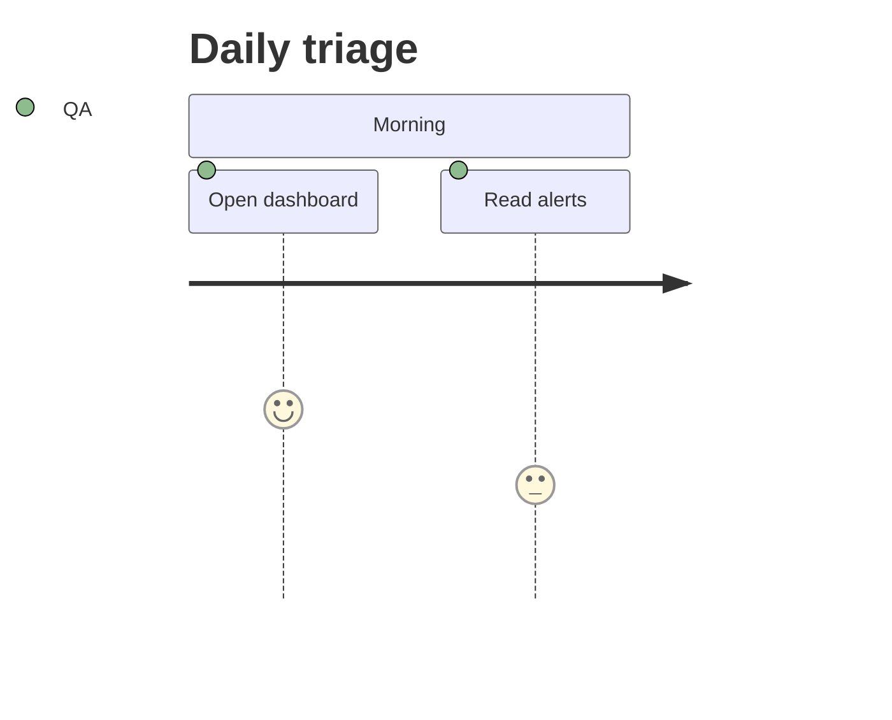

# Frameworks

Reference guide for the six diagram-as-code tools bundled in swgraph.
Each chapter covers the tool's language documentation, how to use it via
`swgraph render`, how it is installed inside the container, which features
are enabled, and known issues.

---

## Graphviz

### Overview

Graphviz is a graph visualization toolkit. You describe nodes and edges in
the DOT language and Graphviz computes the layout and renders the result.
Six layout engines are bundled, each optimised for a different graph topology.

### Documentation

- DOT language reference: <https://graphviz.org/doc/info/lang.html>
- Node, edge and graph attributes: <https://graphviz.org/doc/info/attrs.html>
- Layout engines: <https://graphviz.org/docs/layouts/>
- Shape gallery: <https://graphviz.org/doc/info/shapes.html>
- Color names: <https://graphviz.org/doc/info/colors.html>
- Output formats: <https://graphviz.org/doc/info/output.html>
- Examples gallery: <https://graphviz.org/gallery/>

### File extensions

`.gv`, `.dot`

### Usage with swgraph

```bash
swgraph render /input/diagram.gv
```

The layout engine is auto-detected from a `layout=X` attribute in the
source file. If none is found, `dot` is used. Use `--engine` to override:

```bash
swgraph render --engine neato /input/network.gv
swgraph render --engine sfdp  /input/large_graph.gv
```

### Layout engines

| Engine | Best for | Overlap handling |
|---|---|---|
| `dot` | Hierarchical / layered DAGs; respects `subgraph cluster_*` | N/A (layered) |
| `neato` | Force-directed (springs); reveals coupling | `-Goverlap=prism` |
| `fdp` | Force-directed (Fruchterman-Reingold) | `-Goverlap=prism` |
| `circo` | Circular layout; good for cyclic graphs | None (by design) |
| `twopi` | Radial layout; trees, hub-and-spoke | `-Goverlap=prism` |
| `sfdp` | Scalable force-directed; large graphs (100+ nodes) | `-Goverlap=prism` (GTS) |

For engines other than `dot` and `circo`, swgraph automatically adds
`-Goverlap=prism -Gsplines=true` to produce cleaner output.

### Sketch mode

`--sketch` renders via [sketchviz](https://github.com/gpotter2/sketchviz)
(roughjs + jsdom), producing a hand-drawn SVG. Post-processing:

- HTML named entities (`&nbsp;`, `&copy;`, etc.) are replaced with numeric
  character references (standalone SVG does not support them).
- All `font-family` values are rewritten to `xkcd Script`.
- The xkcd-script font is embedded as a base64 `@font-face` data URI so
  the SVG is fully self-contained.

### Installation in the container

Graphviz is **built from source** (not the Alpine apk package) to enable
features that the packaged version lacks:

- **GTS triangulation** -- required by `sfdp` and by the `prism` overlap
  removal algorithm used in `neato`/`fdp`/`twopi`.
- GTS 0.7.6 is built first, then Graphviz is compiled against it.
- Both land in `/opt/graphviz/`; the `PATH` and `LD_LIBRARY_PATH` are
  set so all six engine binaries are available.

Build flags: `--with-gts --with-pangocairo --with-libgd --with-rsvg`.
All language bindings (Perl, Python, Ruby, Tcl, etc.) are disabled.

**sketchviz** is cloned from `gpotter2/sketchviz` on GitHub and installed
to `/opt/sketchviz/`. A wrapper at `/usr/local/bin/sketchviz` invokes
`node /opt/sketchviz/src/sketch.js`.

**graph-easy** (Perl, `Graph::Easy` from CPAN) is also bundled for
ASCII-art graph output. It is used by the gallery renderer but not by
`swgraph render`.

### Enabled features

- All six layout engines (`dot`, `neato`, `fdp`, `circo`, `twopi`, `sfdp`)
- GTS-backed `sfdp` and `prism` overlap removal
- Cairo, Pango, GD, and librsvg renderers
- SVG and PNG output (PNG via `rsvg-convert`)
- sketchviz hand-drawn rendering
- graph-easy ASCII output (gallery mode only)

### Examples and recommendations

The bundled Graphviz examples cover five common graph shapes. Patterns
worth reusing in your own diagrams:

**Cluster naming.** Graphviz requires the prefix `cluster_` on subgraph
names for them to be drawn as bordered boxes. Misspell it and the
subgraph becomes invisible:

```dot
subgraph cluster_tier1 { ... }   # rendered as a box
subgraph tier1 { ... }           # no box — nodes are ungrouped
```

**Font attributes do not cascade into clusters.** Set `fontname` on the
graph-level `node []` and `edge []` defaults, *and* repeat it on each
`subgraph cluster_*`. Otherwise the cluster label falls back to the
system default.

**Choose the right engine for the topology:**

| Topology | Engine | Tip |
|---|---|---|
| Acyclic tiered modules | `dot` | Use `rankdir=TB` or `LR`; `subgraph cluster_*` for tiers |
| Hub-and-spoke | `twopi` | Set `graph [root=hub_node]` so twopi centres correctly |
| Undirected networks | `neato` / `fdp` | swgraph auto-adds `-Goverlap=prism -Gsplines=true` |
| Large graphs (100+ nodes) | `sfdp` | Requires GTS (built-in); same overlap flags applied |
| Ring / cyclic | `circo` | No overlap flags needed |

**Use `root=X` for twopi.** The `root` attribute tells `twopi` which
node is the centre of the radial layout (see `graphviz_hub_and_spoke.gv`).
Other engines ignore it harmlessly.

**Visual encoding with edge styles.** Differentiate relationship types
by combining `style`, `color`, and `penwidth`:

```dot
a -> b [style=bold, color="#FF9800", penwidth=2.5];   // drill-down
b -> a [style=dashed, color="#90A4AE"];                // back nav
a -> c [style=dotted, color="#E0E0E0"];                // tab cycle
```

**`constraint=false` on secondary edges.** Back-navigation and tab-cycle
edges should not affect the rank ordering. Add `constraint=false` to
prevent them from pulling nodes into unexpected layers.

**Annotations.** Use `shape=note` nodes with `style=dotted, arrowhead=none`
edges to attach explanatory callouts without affecting layout.

**Start simple.** The minimal example (`graphviz_minimal.gv`) renders
with all six engines and in sketch mode. Start with an unstyled graph to
verify structure, then layer on colour, clusters, and edge styles.

### Known issues

- `circo` can crash on some inputs when `-Goverlap=*` is set; swgraph
  intentionally omits overlap flags for `circo`.
- sketchviz emits HTML named entities that are invalid in standalone SVG;
  swgraph patches them automatically.
- graph-easy cannot parse complex DOT constructs (subgraphs, HTML labels);
  failures are logged and skipped.

---

## PlantUML

### Overview

PlantUML is a Java-based tool that renders diagrams from a text DSL. It
supports sequence diagrams, class diagrams, component diagrams, activity
diagrams, state machines, deployment diagrams, C4 architecture models,
and many more.

### Documentation

- Home page: <https://plantuml.com/>
- Language specification: <https://plantuml.com/sitemap-language-specification>
- Sequence diagrams: <https://plantuml.com/sequence-diagram>
- Class diagrams: <https://plantuml.com/class-diagram>
- Component diagrams: <https://plantuml.com/component-diagram>
- Activity diagrams: <https://plantuml.com/activity-diagram-beta>
- State diagrams: <https://plantuml.com/state-diagram>
- Deployment diagrams: <https://plantuml.com/deployment-diagram>
- Preprocessing and includes: <https://plantuml.com/preprocessing>
- Standard library index: <https://plantuml.com/stdlib>
- Theme gallery: <https://plantuml.com/theme>
- C4-PlantUML extension: <https://github.com/plantuml-stdlib/C4-PlantUML>
- AWS icons: <https://github.com/awslabs/aws-icons-for-plantuml>
- Azure icons: <https://github.com/plantuml-stdlib/Azure-PlantUML>
- GCP icons: <https://github.com/davidholsgrove/gcp-icons-for-plantuml>

### File extensions

`.puml`, `.plantuml`

### Usage with swgraph

```bash
swgraph render /input/sequence.puml
```

PlantUML may produce multiple SVGs from a single file when the source
contains multiple `@startuml NAME` blocks. In that case, output files are
named `<stem>-<Name>.svg`.

### Sketch mode

`--sketch` injects the following prelude after each `@startuml` line:

```
!option handwritten true
skinparam defaultFontName "xkcd Script"
skinparam backgroundColor #fffff8
skinparam shadowing false
```

Per-element `FontName` overrides in the source are stripped so the xkcd
font applies uniformly. The xkcd-script font is embedded as a base64
`@font-face` data URI into each output SVG.

**Important:** The `!option handwritten true` preprocessor directive must
be used instead of `skinparam handwritten true`. The `skinparam` form
causes modern PlantUML to embed a deprecation watermark in the output.

### Installation in the container

- **JAR:** Downloaded from GitHub releases to `/opt/plantuml.jar`.
- **Runtime:** OpenJDK 17 JRE (`openjdk17-jre` from apk).
- **Wrapper:** `/usr/local/bin/plantuml` invokes
  `java -Djava.awt.headless=true -jar /opt/plantuml.jar "$@"`.

### Enabled features

- All built-in diagram types (sequence, class, component, activity, state,
  deployment, object, use case, timing, Gantt, mindmap, WBS, JSON, YAML)
- **C4-PlantUML** standard library vendored at `/opt/plantuml-stdlib/c4/`
- **AWS icons** vendored at `/opt/plantuml-stdlib/aws/`
- **Azure icons** vendored at `/opt/plantuml-stdlib/azure/`
- **GCP icons** vendored at `/opt/plantuml-stdlib/gcp/`
- `PLANTUML_INCLUDE_PATH` set to all stdlib directories so `!include`
  works without absolute paths (e.g. `!include C4_Container.puml`)
- SVG output rendered to PNG via `rsvg-convert`

### Examples and recommendations

Six bundled examples cover the most common PlantUML diagram types.

**Name your `@startuml` blocks.** The name controls the output filename.
An unnamed block produces a file named after the source stem, but when a
file contains multiple blocks the names prevent collisions:

```puml
@startuml my_sequence    ← output: my_sequence.svg
...
@enduml
```



**Use the C4-PlantUML stdlib for architecture diagrams.** The macros
`Person()`, `Container()`, `ContainerDb()`, `ContainerQueue()`,
`System_Boundary()`, `System_Ext()`, and `Rel()` produce C4-compliant
diagrams with a consistent look. Add `LAYOUT_WITH_LEGEND()` for an
automatic legend (see `plantuml_c4_container.puml`):

```puml
!include C4_Container.puml
LAYOUT_WITH_LEGEND()
```

The container's `PLANTUML_INCLUDE_PATH` resolves the include without
network access.

**AWS/Azure/GCP icons.** Include `AWSCommon.puml` first, then the
per-service files. The vendored icon libraries are pre-installed under
`/opt/plantuml-stdlib/`:

```puml
!include AWSCommon.puml
!include Compute/EC2.puml
!include Database/RDS.puml
```

**Stereotypes for per-category colouring.** Assign stereotypes to
components and use `skinparam component { BackgroundColor<<tag>> ... }`
to colour-code tiers or layers (see `plantuml_components.puml`).

**State machines.** Use the state-diagram syntax with stereotype-based
colours and styled arrows to encode navigation semantics:

```puml
state "Tab A" as A <<tabA>>
A -[#FF9800,bold]-> B : Enter
B -[#90A4AE,dashed]-> A : b (back)
```

Add multi-line descriptions inside state blocks with `StateName : line`.

**Handwritten mode in source.** If you want the xkcd look baked into
the file itself (rather than via `--sketch`), use the preprocessor
directive — *not* the deprecated skinparam:

```puml
!option handwritten true          ← correct
skinparam defaultFontName "xkcd Script"
skinparam backgroundColor #fffff8
skinparam shadowing false
```

`skinparam handwritten true` embeds a deprecation watermark in modern
PlantUML.

### Known issues

- `skinparam handwritten true` adds a deprecation watermark in recent
  PlantUML versions. Use `!option handwritten true` instead (swgraph
  handles this automatically in `--sketch` mode).
- PlantUML respects `@startuml NAME` for the output filename, which can
  differ from the input filename. swgraph renders into a temp directory
  and renames outputs to avoid collisions.
- C4-PlantUML `!include` paths assume the stdlib is on the include path.
  If you use custom includes, mount them and extend
  `PLANTUML_INCLUDE_PATH` inside the container.

---

## d2

### Overview

d2 is a modern diagram scripting language designed for software
architecture. It features declarative layout, containers, connections,
icons, tooltips, native sketch mode, and a built-in theme system.

### Documentation

- Home page: <https://d2lang.com/>
- Language tour: <https://d2lang.com/tour/intro>
- Shapes: <https://d2lang.com/tour/shapes>
- Connections: <https://d2lang.com/tour/connections>
- Containers: <https://d2lang.com/tour/containers>
- Icons: <https://d2lang.com/tour/icons>
- Themes: <https://d2lang.com/tour/themes>
- Sketch mode: <https://d2lang.com/tour/sketch>
- Source: <https://github.com/terrastruct/d2>

### File extensions

`.d2`

### Usage with swgraph

```bash
swgraph render /input/architecture.d2
```

Additional d2-specific options:

```bash
# Sketch mode with Cool Classics theme and extra padding
swgraph render --sketch --d2-theme 4 --d2-pad 60 /input/architecture.d2
```

| Option | Description |
|---|---|
| `--sketch` | Enable d2's native hand-drawn line style |
| `--d2-theme N` | Theme ID (e.g. `0` = default, `4` = Cool Classics) |
| `--d2-pad PX` | Padding around the diagram in pixels |

### Sketch mode

`--sketch` passes d2's built-in `--sketch` flag, which applies a hand-drawn
line algorithm to all shapes and connections. No font substitution or
post-processing is needed.

Combine with `--d2-theme 4 --d2-pad 60` for the most xkcd-like appearance
d2 can produce out of the box.

### Installation in the container

- **Binary:** Pre-built static `linux/amd64` binary downloaded from GitHub
  releases, placed at `/usr/local/bin/d2`.
- **No wrapper needed** -- d2 is a single static Go binary.

### Enabled features

- All d2 layout engines (dagre is the default)
- Native sketch mode (`--sketch`)
- Built-in themes (passed via `--theme N`)
- Configurable padding (`--pad PX`)
- SVG output rendered to PNG via `rsvg-convert`

### Examples and recommendations

Two bundled examples demonstrate d2's architecture and journey patterns.

**Container nesting for architectural boundaries.** d2 nests containers
naturally — child nodes are declared inside the parent block. Use
dot-notation for cross-container connections:

```d2
api: "API tier" {
  a1: "api-1"
  a2: "api-2"
}
lb -> api.a1
lb -> api.a2
```

**Shape selection.** d2 has built-in shapes that communicate intent:

| Shape | Meaning | Example |
|---|---|---|
| `person` | Human actor | `users: { shape: person }` |
| `cloud` | External / SaaS | `cdn: { shape: cloud }` |
| `cylinder` | Database / store | `db: { shape: cylinder }` |
| `queue` | Message queue | `q: { shape: queue }` |
| `page` | Document / form | `form: { shape: page }` |
| `oval` | Start / abstract | `start: { shape: oval }` |
| `hexagon` | Key milestone | `goal: { shape: hexagon }` |

**Dashed edges for alternate paths.** Use `style.stroke-dash` to
visually separate error or drop-off flows from the happy path:

```d2
signup -> bounced: "abandons" { style.stroke-dash: 3 }
```

**Per-node fills.** Override individual node colours with `style.fill`
to highlight important steps:

```d2
goal: "Key action" { shape: hexagon; style.fill: "#fff7e0" }
```

**Direction.** Set `direction: right` for horizontal architectures or
`direction: down` for vertical journeys. The default is top-to-bottom.

**Sketch + theme combo.** For the most xkcd-like d2 rendering, combine
`--sketch` with Cool Classics:

```bash
swgraph render --sketch --d2-theme 4 --d2-pad 60 /input/arch.d2
```

### Known issues

- d2 is a static `linux/amd64` binary. The container only supports
  `linux/amd64`; `arm64` builds are not available.
- d2's `--theme` accepts integer IDs, not names. Common IDs: `0` (default
  neutral), `1` (Origami), `3` (Flagship Terrastruct), `4` (Cool Classics).
  See <https://d2lang.com/tour/themes> for the full list.

---

## ditaa

### Overview

ditaa (DIagrams Through Ascii Art) converts ASCII art diagrams into bitmap
graphics. You draw boxes, arrows, and lines using characters like `+`, `-`,
`|`, `/`, `\`, and ditaa renders them as a proper raster image.

### Documentation

- Home page: <https://ditaa.sourceforge.net/>
- Syntax and usage: <https://ditaa.sourceforge.net/#usage>
- Source: <https://github.com/stathissideris/ditaa>

### File extensions

`.ditaa`

### Usage with swgraph

```bash
swgraph render /input/network.ditaa
```

### Sketch mode

Not supported. ditaa has no hand-drawn mode. The `--sketch` flag is
accepted but has no effect on ditaa files.

### Output format

**PNG only.** ditaa does not support SVG output. This is a tool limitation,
not an error. No SVG file is produced; only `<stem>.png`.

### Installation in the container

- **JAR:** Downloaded from GitHub releases to `/opt/ditaa.jar`.
- **Runtime:** OpenJDK 17 JRE (shared with PlantUML and Structurizr).
- **Wrapper:** `/usr/local/bin/ditaa` invokes
  `java -Djava.awt.headless=true -jar /opt/ditaa.jar "$@"`.

### Enabled features

- Default rendering with `--no-shadows --round-corners` flags applied
  automatically by swgraph for cleaner output.
- PNG output only (no SVG-to-PNG conversion step needed).

### Examples and recommendations

One bundled example (`ditaa_network.ditaa`) shows a multi-tier network
diagram.

**Use a monospace editor.** ditaa is character-position-sensitive. Box
edges must align vertically for connectors to attach cleanly. A
proportional font will produce misaligned output.

**Colour codes.** Put a `cXXX` tag (3-digit hex) inside a box to set
its fill colour. The code must appear on a line inside the box borders:

```
+---------------+
|  Web tier     |
|  c8FA web-1   |
+---------------+
```

Common colours: `c5F4` (green tint), `c8FA` (amber), `c9F9` (blue),
`c66E` (dark green), `cF6E` (pink).

**Storage shape.** Add `{s}` inside a box to render it as a cylinder
(database/storage):

```
+---------------+
|   Postgres    |
|   c66E   {s}  |
+---------------+
```

**Keep boxes wide enough.** Short box labels can cause the colour code
or shape tag to overlap with the border characters. Pad with spaces.

**Connector alignment.** Vertical connectors (`|`) must line up with
the `+` corners of the boxes above and below. Horizontal connectors
(`-`) must span between `+` characters on the same line.

### Known issues

- No SVG output. ditaa only produces PNG.
- No sketch/hand-drawn mode.
- Complex ASCII art with Unicode characters may not render correctly;
  ditaa expects ASCII box-drawing characters.

---

## Mermaid

### Overview

Mermaid is a JavaScript-based diagramming and charting tool. It supports
flowcharts, sequence diagrams, class diagrams, state diagrams, ER diagrams,
Gantt charts, journey maps, pie charts, quadrant charts, and C4 diagrams.

swgraph renders Mermaid diagrams **server-side** using `mmdc`
(@mermaid-js/mermaid-cli) with headless Chromium, producing static SVG and
PNG files.

### Documentation

- Home page: <https://mermaid.js.org/>
- Syntax reference: <https://mermaid.js.org/intro/syntax-reference.html>
- Flowcharts: <https://mermaid.js.org/syntax/flowchart.html>
- Sequence diagrams: <https://mermaid.js.org/syntax/sequenceDiagram.html>
- Class diagrams: <https://mermaid.js.org/syntax/classDiagram.html>
- State diagrams: <https://mermaid.js.org/syntax/stateDiagram.html>
- Entity relationship: <https://mermaid.js.org/syntax/entityRelationshipDiagram.html>
- Gantt charts: <https://mermaid.js.org/syntax/gantt.html>
- User journeys: <https://mermaid.js.org/syntax/userJourney.html>
- C4 diagrams: <https://mermaid.js.org/syntax/c4.html>
- Pie charts: <https://mermaid.js.org/syntax/pie.html>
- Theming: <https://mermaid.js.org/config/theming.html>
- Live editor: <https://mermaid.live/>
- Source: <https://github.com/mermaid-js/mermaid>

### File extensions

`.mmd`, `.mermaid`

### Usage with swgraph

```bash
swgraph render /input/flowchart.mmd
```

Two rendering backends are available:

```bash
# Default: mmdc (Chromium-based, full compatibility)
swgraph render --mermaid-backend mmdc /input/flowchart.mmd

# Experimental: isomorphic-mermaid (no browser, faster, limited support)
swgraph render --mermaid-backend isomorphic /input/flowchart.mmd
```

### Sketch mode

`--sketch` prepends a `%%{init: ...}%%` directive to the source that sets:

- `"look": "handDrawn"` -- hand-drawn line rendering
- `"theme": "base"` -- neutral base theme with custom colours
- Warm colour palette (`#fffff8` background, `#fffde7` primary)
- `"flowchart": {"curve": "basis"}` -- smooth spline curves

The directive is injected into a temporary copy of the source; the
original file is not modified.

### Installation in the container

- **mmdc:** Installed globally via `npm install -g @mermaid-js/mermaid-cli`.
  Uses Alpine's system Chromium (`/usr/bin/chromium-browser`) instead of
  Puppeteer's bundled download (`PUPPETEER_SKIP_DOWNLOAD=true`).
- **Puppeteer config:** `/etc/mmdc.json` sets the Chromium executable path
  and sandbox flags:
  ```json
  {
    "executablePath": "/usr/bin/chromium-browser",
    "args": ["--no-sandbox", "--disable-gpu", "--disable-dev-shm-usage"]
  }
  ```
- **isomorphic-mermaid:** Installed globally via
  `npm install -g isomorphic-mermaid`. This is an **experimental** ESM-only
  module that renders Mermaid diagrams without a browser. It is invoked
  via Node.js with `--input-type=module` and a full path import from
  `/usr/local/lib/node_modules/isomorphic-mermaid/dist/main.js`.

### Enabled features

- All Mermaid diagram types (flowchart, sequence, class, state, ER, Gantt,
  journey, pie, quadrant, C4, mindmap, timeline, etc.)
- Server-side rendering to static SVG (no browser required on the host)
- Hand-drawn look via `%%{init: {"look":"handDrawn"}}%%`
- SVG output rendered to PNG via `rsvg-convert`
- Two backends: mmdc (stable, full compatibility) and isomorphic-mermaid
  (experimental, faster, no Chromium dependency)

### Examples and recommendations

Four bundled examples cover the most-used Mermaid diagram types.

**Flowchart node shapes.** Mermaid uses bracket syntax for shapes:

| Syntax | Shape | Example |
|---|---|---|
| `[text]` | Rectangle | `Login[Login screen]` |
| `([text])` | Stadium / pill | `Start([User opens app])` |
| `{text}` | Diamond | `Auth{Authenticated?}` |
| `[(text)]` | Cylinder | `Save[(Saved to DB)]` |

**Edge labels.** Put labels between pipes on the arrow:

```mermaid
Auth -->|yes| Home
Auth -->|no| Login
```

**Per-node styling.** Use `style` directives at the end of the diagram
to highlight specific nodes:

```mermaid
style Save fill:#cfe8cf,stroke:#2e7d32
style Login fill:#ffe0b2,stroke:#ef6c00
```

**Sequence diagrams.** `autonumber` adds step numbers automatically.
Use `participant X as Y` for short aliases and `alt`/`else`/`end` for
conditional branches (see `mermaid_sequence.mmd`).

**C4 context diagrams.** Mermaid supports C4 via the `C4Context` diagram
type with `Person()`, `System()`, `System_Ext()`, `System_Boundary()`,
and `Rel()` macros (see `mermaid_c4.mmd`). Layout control is more
limited than PlantUML's C4; use PlantUML for complex C4 views.

**User journeys.** The `journey` type uses a simple `Task : score : actors`
format. Sections group tasks into phases. Scores (1-5) control the
colour gradient from red to green:



**Direction.** Set `flowchart TB` (top-to-bottom), `LR` (left-to-right),
etc. immediately after the diagram type keyword.

### Known issues

- **isomorphic-mermaid is ESM-only.** It requires `--input-type=module` and
  a full filesystem path to the module entry point. Standard `require()`
  and `NODE_PATH`-based resolution do not work.
- mmdc requires headless Chromium, which adds ~400 MB to the container
  image.
- Mermaid v10+ silently ignores `fontFamily` set via per-diagram
  `%%{init}%%` directives. Font family must be set via
  `mermaid.initialize()` in the gallery's JavaScript (not relevant for
  `swgraph render`, which does not substitute fonts).
- Some diagram types (e.g. mindmap, timeline) may have limited support in
  the isomorphic backend.

---

## Structurizr

### Overview

Structurizr is an architecture-as-code tool based on the C4 model. A
`.dsl` workspace file defines a software model (people, software systems,
containers, components) and the views that visualise it. swgraph exports the
workspace to PlantUML via the Structurizr CLI, then renders each view.

### Documentation

- Home page: <https://structurizr.com/>
- DSL language reference: <https://docs.structurizr.com/dsl/language>
- DSL cookbook: <https://docs.structurizr.com/dsl/cookbook/>
- DSL examples: <https://docs.structurizr.com/dsl/examples>
- C4 model: <https://c4model.com/>
- Source: <https://github.com/structurizr/cli>
- Structurizr DSL playground: <https://structurizr.com/dsl>

### File extensions

`.dsl`

### Usage with swgraph

```bash
swgraph render /input/workspace.dsl
```

A single `.dsl` file typically defines multiple views (System Context,
Container, Component, etc.). swgraph renders **all views** in the workspace.
Output files are named `<stem>-<ViewName>.svg` and `<stem>-<ViewName>.png`.

### Sketch mode

`--sketch` injects the PlantUML handwritten prelude into each exported
`.puml` view before rendering. The mechanism is identical to PlantUML's
sketch mode:

- `!option handwritten true`
- `skinparam defaultFontName "xkcd Script"`
- xkcd-script font embedded as base64 in each SVG

### Installation in the container

- **CLI:** Downloaded as a ZIP from GitHub releases, extracted to
  `/opt/structurizr/`.
- **Runtime:** OpenJDK 17 JRE (shared with PlantUML and ditaa).
- **Wrapper:** `/usr/local/bin/structurizr` invokes
  `/opt/structurizr/structurizr.sh "$@"`.

### Rendering pipeline

1. `structurizr export -workspace <file> -format plantuml -output <tmpdir>`
2. For each generated `.puml` file in the temp directory:
   - If `--sketch`, inject handwritten prelude after `@startuml`
   - Render via `plantuml -tsvg`
   - Convert SVG to PNG via `rsvg-convert`

### Enabled features

- Full Structurizr DSL support (workspace, model, views, styles, themes)
- Export to PlantUML format
- All PlantUML features available for the exported views (including
  the vendored C4/AWS/Azure/GCP stdlibs)
- Multi-view rendering (one SVG+PNG pair per view)
- Sketch mode via PlantUML handwritten prelude

### Examples and recommendations

One bundled example (`structurizr_workspace.dsl`) defines a complete
workspace with model, views, and styles.

**Workspace structure.** A `.dsl` file has three top-level sections:

```dsl
workspace "Name" "Description" {
    model { ... }
    views { ... }
}
```

**Model hierarchy.** Declare people, software systems, and containers.
Nest containers inside their parent system:

```dsl
rm = softwareSystem "Release Manager" "Description" {
    web = container "Web App" "SPA" "React"
    api = container "API" "REST" "FastAPI"
    db  = container "Database" "State" "PostgreSQL" "Database"
}
```

The trailing `"Database"` string is a **tag** used for styling.

**Relationships.** Declare at the model level with `->`:

```dsl
qa -> web "Triages via"
api -> db "Reads / writes"
poller -> openqa "Polls" "REST"
```

**Multiple views from one file.** Define `systemContext` and `container`
views to get a high-level and a detailed diagram from the same model.
Each view becomes a separate SVG+PNG pair:

```dsl
views {
    systemContext rm "Context" { include *; autolayout lr }
    container rm "Containers"  { include *; autolayout tb }
}
```

**Use `autolayout`.** Without it, all nodes stack on a single point.
Use `autolayout lr` (left-to-right) or `autolayout tb` (top-to-bottom).

**Style by tag.** Assign tags to elements (e.g. `"External"`,
`"Database"`) and define styles per tag in the `views.styles` block:

```dsl
element "Person"   { background "#08427b"; color "#ffffff"; shape Person }
element "External" { background "#999999"; color "#ffffff" }
element "Database" { shape Cylinder }
```

**External systems.** Mark them with a tag and style them in grey to
visually distinguish them from the system under description.

### Known issues

- Structurizr exports to PlantUML, not directly to SVG. The visual
  appearance depends on PlantUML's rendering of the exported code, which
  may differ from Structurizr's native web renderer.
- View names in the DSL become part of the output filename. Spaces or
  special characters in view names may cause issues on some filesystems.
- The Structurizr CLI is a Java application; first invocation may be slow
  due to JVM startup time.
