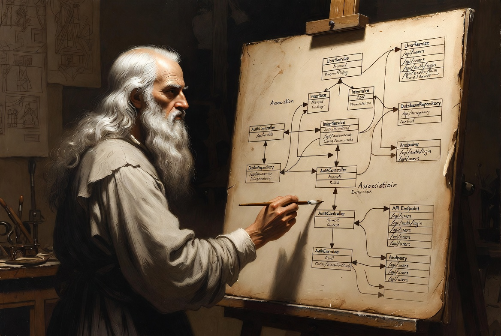

# swgraph

[](https://github.com/mpagot/swgraph/actions/workflows/publish.yml)
[](https://ghcr.io/mpagot/swgraph)
[](https://ghcr.io/mpagot/swgraph)



Containerized software diagramming toolkit.

swgraph is an all-in-one container image that renders diagram-as-code source
files into SVG and PNG artifacts. One image, six diagram languages, zero local
installs.

## Quick start

```bash
# Build the image (first time only)
podman build -t swgraph .

# Render a single file
podman run --rm \
  -v ./diagrams:/input:ro \
  -v ./out:/output \
  swgraph \
  swgraph render /input/architecture.puml

# Render multiple files at once
podman run --rm \
  -v ./diagrams:/input:ro \
  -v ./out:/output \
  swgraph \
  swgraph render /input/network.gv /input/sequence.puml /input/flow.mmd

# Render an entire directory (all supported extensions)
podman run --rm \
  -v ./diagrams:/input:ro \
  -v ./out:/output \
  swgraph \
  sh -c 'swgraph render /input/*'
```

Output appears in `./out/` as `<stem>.svg` and `<stem>.png` for each input.

## CLI reference

### `swgraph render`

```
swgraph render [OPTIONS] FILE [FILE...]
```

Renders one or more diagram source files. The tool is auto-detected from the
file extension.

| Option | Description |
|---|---|
| `-o, --output DIR` | Output directory (default: `/output`) |
| `--sketch` | Enable hand-drawn / xkcd style where supported |
| `--engine ENGINE` | Force a Graphviz layout engine: `dot`, `neato`, `fdp`, `circo`, `twopi`, `sfdp` (overrides auto-detect) |
| `--d2-theme N` | d2 theme ID (e.g. `4` for Cool Classics) |
| `--d2-pad PX` | d2 diagram padding in pixels |
| `--mermaid-backend` | `mmdc` (default, Chromium-based) or `isomorphic` (experimental, no browser) |
| `-q, --quiet` | Suppress informational messages |
| `-v, --verbose` | Show tool stdout/stderr |

### `swgraph verify`

```
swgraph verify
```

Runs 31 checks to confirm every bundled tool is installed and functional.
Useful after building the image or in CI.

### `swgraph version`

```
swgraph version
```

Prints the swgraph version string.

## Usage examples

### Hand-drawn / xkcd style

The `--sketch` flag activates a hand-drawn aesthetic for every tool that
supports it:

```bash
podman run --rm -v .:/input:ro -v ./out:/output swgraph \
  swgraph render --sketch /input/architecture.puml /input/deps.gv /input/flow.mmd
```

| Tool | Sketch mechanism |
|---|---|
| Graphviz | [sketchviz](https://sketchviz.com/) (roughjs) + embedded xkcd font |
| PlantUML | `!option handwritten true` + xkcd Script font |
| d2 | `--sketch` flag (native hand-drawn lines) |
| Mermaid | `%%{init: {"look":"handDrawn"}}%%` directive |
| Structurizr | Handwritten prelude injected into exported PlantUML |
| ditaa | Not supported (PNG only, no sketch mode) |

### Forcing a Graphviz engine

By default the engine is auto-detected from a `layout=X` attribute in the
source file, falling back to `dot`. Use `--engine` to override:

```bash
# Force neato (spring-model layout)
podman run --rm -v .:/input:ro -v ./out:/output swgraph \
  swgraph render --engine neato /input/network.gv

# Force sfdp (scalable force-directed, good for large graphs)
podman run --rm -v .:/input:ro -v ./out:/output swgraph \
  swgraph render --engine sfdp /input/large_graph.gv
```

### d2 themes and padding

```bash
podman run --rm -v .:/input:ro -v ./out:/output swgraph \
  swgraph render --sketch --d2-theme 4 --d2-pad 60 /input/infra.d2
```

### Verify the container image

```bash
podman run --rm swgraph swgraph verify
```

### Use in CI

```bash
podman run --rm \
  -v "$PWD/docs/diagrams:/input:ro" \
  -v "$PWD/docs/images:/output" \
  ghcr.io/<owner>/swgraph:latest \
  swgraph render /input/*.puml /input/*.gv /input/*.mmd
```

## Supported input formats

### Graphviz (`.gv`, `.dot`)

General-purpose graph description language. Six layout engines are bundled
(custom-built with GTS triangulation support):

| Engine | Best for |
|---|---|
| `dot` | Hierarchical / layered DAGs; respects `subgraph cluster_*` |
| `neato` | Force-directed (springs); reveals coupling |
| `fdp` | Force-directed (Fruchterman-Reingold) |
| `circo` | Circular layout; good for cyclic graphs |
| `twopi` | Radial layout; trees and hub-and-spoke |
| `sfdp` | Scalable force-directed; large graphs (100+ nodes) |

- Reference: <https://graphviz.org/documentation/>
- DOT language: <https://graphviz.org/doc/info/lang.html>
- Layout engines: <https://graphviz.org/docs/layouts/>
- Node/edge attributes: <https://graphviz.org/doc/info/attrs.html>
- Gallery: <https://graphviz.org/gallery/>

### PlantUML (`.puml`, `.plantuml`)

Diagram tool with a rich text-based DSL covering sequence diagrams, class
diagrams, component diagrams, state machines, C4 models, and more. Bundled
standard libraries include C4-PlantUML, AWS, Azure, and GCP icon sets.

- Reference: <https://plantuml.com/>
- Language specification: <https://plantuml.com/sitemap-language-specification>
- Sequence diagrams: <https://plantuml.com/sequence-diagram>
- Class diagrams: <https://plantuml.com/class-diagram>
- Component diagrams: <https://plantuml.com/component-diagram>
- State diagrams: <https://plantuml.com/state-diagram>
- C4 model extension: <https://github.com/plantuml-stdlib/C4-PlantUML>
- AWS icons: <https://github.com/awslabs/aws-icons-for-plantuml>
- Standard library index: <https://plantuml.com/stdlib>
- Preprocessing / includes: <https://plantuml.com/preprocessing>

### d2 (`.d2`)

A modern diagram scripting language designed for software architecture.
Features declarative layout, native sketch mode, themes, and containers.

- Reference: <https://d2lang.com/>
- Language tour: <https://d2lang.com/tour/intro>
- Themes: <https://d2lang.com/tour/themes>
- Sketch mode: <https://d2lang.com/tour/sketch>
- Icons: <https://d2lang.com/tour/icons>
- Source: <https://github.com/terrastruct/d2>

### ditaa (`.ditaa`)

Converts ASCII art diagrams into bitmap graphics. Input files contain
plain-text box-and-arrow drawings.

**Note:** ditaa produces PNG only (no SVG output). This is a tool limitation,
not an error.

- Reference: <https://ditaa.sourceforge.net/>
- Syntax: <https://ditaa.sourceforge.net/#usage>
- Source: <https://github.com/stathissideris/ditaa>

### Mermaid (`.mmd`, `.mermaid`)

JavaScript-based diagramming and charting tool. Supports flowcharts, sequence
diagrams, Gantt charts, class diagrams, state diagrams, ER diagrams, journey
maps, and C4 diagrams. Rendered server-side via headless Chromium (mmdc).

- Reference: <https://mermaid.js.org/>
- Syntax overview: <https://mermaid.js.org/intro/syntax-reference.html>
- Flowcharts: <https://mermaid.js.org/syntax/flowchart.html>
- Sequence diagrams: <https://mermaid.js.org/syntax/sequenceDiagram.html>
- Class diagrams: <https://mermaid.js.org/syntax/classDiagram.html>
- State diagrams: <https://mermaid.js.org/syntax/stateDiagram.html>
- C4 diagrams: <https://mermaid.js.org/syntax/c4.html>
- Live editor: <https://mermaid.live/>
- Source: <https://github.com/mermaid-js/mermaid>

### Structurizr DSL (`.dsl`)

Architecture-as-code using the C4 model. A `.dsl` workspace defines a
software model (people, systems, containers, components) and views. swgraph
exports the workspace to PlantUML via Structurizr CLI, then renders each
view to SVG + PNG.

- Reference: <https://structurizr.com/>
- DSL language reference: <https://docs.structurizr.com/dsl/language>
- DSL cookbook: <https://docs.structurizr.com/dsl/cookbook/>
- C4 model: <https://c4model.com/>
- Source: <https://github.com/structurizr/cli>

## Output

For each input file, swgraph produces:

| Input | Output |
|---|---|
| `network.gv` | `network.svg` + `network.png` |
| `sequence.puml` | `sequence.svg` + `sequence.png` |
| `infra.d2` | `infra.svg` + `infra.png` |
| `boxes.ditaa` | `boxes.png` (PNG only) |
| `flow.mmd` | `flow.svg` + `flow.png` |
| `workspace.dsl` | `workspace-<ViewName>.svg` + `.png` (one pair per view) |

Errors are logged but do not stop processing of remaining files. The exit
code is non-zero if any file failed to render.

## Building

```bash
# Build with podman (recommended)
make build

# Or directly
podman build -t swgraph .
```

The image is based on Alpine Linux with a multi-stage build. Final image
size is approximately 2 GB (includes Java 17, Chromium, Graphviz built from
source with GTS, and all diagram tools).

## Gallery mode

For side-by-side comparison of all rendering engines and styles:

```bash
make render
```

This renders every file in `examples/` with all applicable variants
(6 Graphviz engines, sketch modes, d2 themes) and produces an HTML gallery
at `out/index.html`.

## Container image

Published to GitHub Container Registry on every push to `main`:

```bash
podman pull ghcr.io/<owner>/swgraph:latest
```

Tags: `latest`, short git SHA, date stamp (`YYYYMMDD`), semver on releases.

## License

See [LICENSE](LICENSE).
